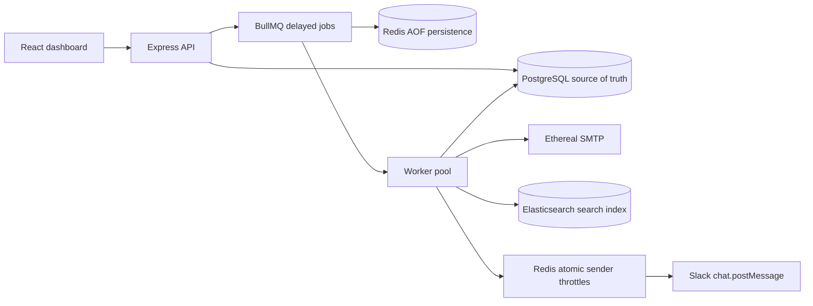

# ReachInbox Email Scheduler

An email campaign scheduler built around durable BullMQ delayed jobs, PostgreSQL state, distributed Redis throttling, SMTP delivery through Ethereal, Slack notifications, and an Elasticsearch search index. The React dashboard supports Google sign in, campaign creation, CSV/text lead parsing, scheduled and sent views, Slack connection, and the Bull Board queue monitor.

## Architecture



## Stack and layout

- `apps/backend`: Express, TypeScript, Prisma, BullMQ, Nodemailer, Elasticsearch client, OAuth routes, Bull Board, and Vitest.
- `apps/frontend`: Vite, React, TypeScript, Tailwind, and the dashboard.
- `docker-compose.yml`: PostgreSQL, Redis with append-only persistence, and single-node Elasticsearch. Database, queue, and index data use named volumes.

PostgreSQL is authoritative for users, senders, campaigns, and email lifecycle. Each email gets a database row and its own deterministic BullMQ job ID (`email-{emailId}`). Redis stores delayed job state persistently. Elasticsearch is a rebuildable search index and failures to index do not interrupt delivery.

## Prerequisites and setup

Node.js 20+, npm, and Docker with Compose. Copy `.env.example` to `.env`, then supply OAuth and SMTP credentials. Google sign-in requires a Google OAuth web client with the callback URL below. Slack requires a Slack app with `chat:write` and `im:write` bot scopes and its OAuth redirect. Create an Ethereal account at ethereal.email; it previews test messages and does not deliver to real recipients.

```sh
cp .env.example .env
docker compose up -d
npm install
npm run prisma:generate
npm run prisma:migrate
npm run dev
```

`npm run dev` starts API (`:4000`), worker, and frontend (`:5173`). Add a sender after Google login with the **Add sender** button in the dashboard. Swagger is not bundled; API routes are summarized below. Bull Board is at `http://localhost:4000/admin/queues`.

## Environment

See `.env.example`. Required core values are `DATABASE_URL`, `REDIS_URL`, and a long random `SESSION_SECRET`. Real integration flows require Google client ID/secret/callback, Slack client ID/secret/callback, a 32-byte `SLACK_TOKEN_ENCRYPTION_KEY`, and `ETHEREAL_USER`/`ETHEREAL_PASS`. `WORKER_CONCURRENCY`, `MIN_EMAIL_DELAY_MS`, and `DEFAULT_HOURLY_LIMIT` configure execution. Use HTTPS and `COOKIE_SECURE=true` outside local development.

Google callback: `http://localhost:4000/api/auth/google/callback`. Slack callback: `http://localhost:4000/api/slack/callback`. Google consent screen must permit the account used for the demo. Slack OAuth stores the bot token encrypted with AES-256-GCM in PostgreSQL; token decryption key rotation requires reauthorizing Slack.

## Google OAuth Setup

Create a Google OAuth web client and add `http://localhost:4000/api/auth/google/callback` as an authorized redirect URI. Set `GOOGLE_CLIENT_ID`, `GOOGLE_CLIENT_SECRET`, and `GOOGLE_CALLBACK_URL` in the root `.env`. While the consent screen is in testing mode, add the demo account as a test user. OAuth state is checked through the Redis-backed session.

## Slack OAuth Setup

Add `http://localhost:4000/api/slack/callback` to the Slack app's redirect URLs. Set `SLACK_CLIENT_ID`, `SLACK_CLIENT_SECRET`, and `SLACK_CALLBACK_URL`. The OAuth request requires bot scopes `chat:write` and `im:write`; it opens a DM with the authorizing user and posts limit alerts. `SLACK_TOKEN_ENCRYPTION_KEY` must be exactly 32 ASCII bytes. The signing secret and verification token are not used because the app does not receive Slack Events API webhooks.

## Ethereal Setup

Create an Ethereal test account and set `ETHEREAL_USER` and `ETHEREAL_PASS`. Optional transport settings are `SMTP_HOST`, `SMTP_PORT`, and `SMTP_SECURE`. Ethereal captures messages for browser preview; it does not deliver to real inboxes.

## Running Backend, Worker, and Frontend

`npm run dev` starts all three processes. They can also run separately: `npm run dev:backend`, `npm run worker`, and `npm run dev:frontend`. The API listens on port 4000, the Vite dashboard on port 5173, and Bull Board is mounted at `/admin/queues` for authenticated users.

## API

- `GET /api/health`: process health.
- `GET /api/auth/google`, `GET /api/auth/google/callback`, `POST /api/auth/logout`: Google OAuth session.
- `GET /api/me`: current user.
- `GET/POST /api/senders`: list or upsert an authenticated user's sender.
- `POST /api/campaigns`: validate and create a campaign and one email row per recipient, then enqueue individual delayed jobs. Body fields: `subject`, `body`, `recipients`, optional `senderId`, ISO `startTime`, `delayBetweenEmails` in milliseconds, `hourlyLimit`, and `idempotencyKey`.
- `GET /api/emails?status=scheduled|sent|failed|processing`: list emails for the current user.
- `GET /api/search?q=...`: Elasticsearch full text search.
- `GET /api/slack/connect`, `GET /api/slack/callback`, `GET/DELETE /api/slack`: connect and disconnect Slack.
- `GET /api/queue`: queue counts; Bull Board has detailed job state.

Lead uploads accept comma, semicolon, tab, and newline separated addresses from CSV/text. The browser filters malformed addresses; the API validates and deduplicates recipients case-insensitively.

## Scheduling and delivery

The API writes campaign, email, and queue-outbox records in one PostgreSQL transaction. It then enqueues one delayed BullMQ job per email using `max(0, scheduledAt - now)` and marks each outbox row complete. On API startup, unacknowledged outbox rows are retried using deterministic job IDs, so a PostgreSQL/Redis dual-write failure is recoverable without periodic polling. Start time plus per-recipient spacing determines initial schedule. BullMQ/Redis retains delayed jobs across API and worker restarts; no cron or polling scheduler is used.

Before each send, a Redis Lua script atomically prunes the sender's rolling hourly sorted set, checks the campaign hourly cap, and enforces the larger of campaign delay and configured minimum spacing. A rate limited active job moves itself into BullMQ delayed state with its same deterministic job ID and the database scheduledAt is updated. Redis deduplicates Slack alerts to at most one per sender per hour; each alert describes the sender cap, next available window, and pending count.

The worker claims a scheduled email with a conditional database status transition before sending. Sent rows are not sent again on ordinary job replay. SMTP cannot provide an exactly-once transaction spanning SMTP and PostgreSQL: if a process dies after SMTP accepts a message but before the sent status commits, a retry can duplicate delivery. Provider idempotency support would be needed to close this failure window. A database processing lease lets a stalled BullMQ job wait for and reclaim abandoned work without adding a polling scheduler.

Redis AOF (`appendonly yes`) and Docker named volumes preserve queue data across container restarts; PostgreSQL uses its own named volume. Removing volumes deletes persistent data. Elasticsearch indexes email ID, campaign ID, sender ID, recipient, subject, body, status, schedule time, sent time, and creation time. It is not the source of truth and can be reindexed from PostgreSQL by a future maintenance command.

## Rate limiting, concurrency, and scale

Worker concurrency defaults to 5 and is configurable. Redis coordinates sender minimum spacing and hourly rolling limits across worker processes. Campaign hourly limit is used as the sender cap for that campaign's jobs; campaigns sharing a sender with different limits can therefore have different caps, an assumption to consider when configuring concurrent campaigns. Large lead sets are capped at 10,000 addresses per API request and create one row/job per recipient. Production scale should batch database inserts and queue adds, and use per-sender shared policy independent of campaign configuration.

## Testing and known limitations

`npm test` runs unit tests for case-insensitive lead deduplication, deterministic BullMQ IDs, idempotency-key generation, HTTP health, unauthenticated API rejection, and Bull Board protection. Service-backed rate-limit, restart, OAuth, SMTP, and search tests still require running Docker services and an interactive provider authorization. The provided Figma link could not be opened in this environment, so exact visual parity could not be checked. Rate-limit Slack delivery depends on a successful Slack API call. SMTP and Elasticsearch outages require operational monitoring/reconciliation.

## Five-minute demo

1. Configure `.env` with Google, Slack, and Ethereal credentials; start `docker compose up -d`, run migrations, then `npm run dev`.
2. Open `http://localhost:5173` and sign in with Google.
3. Click **Add sender** and enter the sender name and email address.
4. Connect Slack from the dashboard. Create a campaign, upload/paste 10 recipients, choose a start a few minutes ahead, a 2-second delay, and a low hourly cap.
5. View scheduled rows and Bull Board. Restart the worker/API while jobs are delayed; Redis-backed delayed jobs remain. Watch sent rows and search after execution; view previews in the Ethereal mailbox.

To build/typecheck/test: `npm run build`, `npm run typecheck`, and `npm test`. `npm run lint` is provided as a workspace command. The current audit has two remaining moderate findings in development-only Vitest packages; production dependencies audit clean.