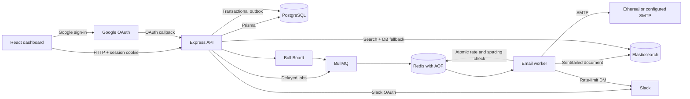

# ReachInbox Email Scheduler

**A full-stack email scheduling application built around durable delayed jobs, per-sender rate controls, and a live inbox dashboard.** Campaigns are stored in PostgreSQL, queued with BullMQ on Redis, and delivered through an Ethereal SMTP account.

**Author:** Naman Mahajan

## Features

- Schedule an email campaign for one or more unique recipients; optional CSV/text lead parsing is available in the dashboard.
- Create one BullMQ delayed job per email with deterministic job IDs and a PostgreSQL transactional outbox.
- Configure worker concurrency, minimum spacing between emails, and a rolling hourly sender limit.
- Coordinate spacing and hourly limits across worker processes with an atomic Redis Lua operation; move rate-limited jobs back into the delayed state.
- Send text and HTML email with up to five attachments (5 MB total per campaign) through configured SMTP, with Ethereal as the sample provider.
- Authenticate with Google OAuth or create an account and sign in with email and password.
- Browse scheduled, processing, sent, and failed emails with database-backed pages of 50; view email details; star, archive, unarchive, and move emails to Trash.
- Search by subject, body, recipient, or sender using Elasticsearch with PostgreSQL-backed ownership, filters, and fallback matching.
- Use dedicated Starred, Archived, and Trash folders, with single and bulk archive, star, restore, and trash actions.
- Permanently delete trashed emails with confirmation; attachments are campaign-scoped and are cleaned up when the campaign has no remaining emails.
- Filter scheduled and sent mail by local-time date ranges while preserving search and folder filters across pages.
- Connect Slack through OAuth for direct-message rate-limit alerts; the stored bot token is encrypted in PostgreSQL.
- Inspect queue states in the authenticated Bull Board dashboard.
- Run the local stack with Docker Compose: PostgreSQL, Redis, and Elasticsearch use named data volumes.
- Automated backend tests cover scheduling helpers, lead parsing and deduplication, HTTP protections, password sessions, and persisted email actions.

## Architecture



PostgreSQL stores users, senders, campaigns, email state, attachments, Slack connections, and queue-outbox records. Redis holds BullMQ jobs, session data, and the rolling sender-rate data. Elasticsearch is the search index; PostgreSQL remains the source of truth. Bull Board exposes queue state through the API server and requires an authenticated session.

## Scheduling and delivery

1. The dashboard submits a campaign with a subject, message, recipients, optional attachments, start time, spacing, and hourly cap.
2. The API validates the request, removes duplicate recipient addresses case-insensitively, and checks the attachment count and total size.
3. PostgreSQL creates the campaign, individual email records, and outbox rows in a transaction. Each email receives a unique idempotency key.
4. The API dispatches outbox rows as delayed BullMQ jobs. The job ID is `email-{emailId}`; the delay is calculated from the email's scheduled time.
5. At startup, the API retries outbox rows that were not acknowledged as enqueued. Deterministic BullMQ IDs make a retry of an existing queue job idempotent.
6. A worker claims eligible email records in PostgreSQL. Redis atomically checks the rolling hourly limit and minimum spacing before delivery.
7. A rate-limited job updates its scheduled time and moves itself into BullMQ's delayed state. Slack notification is attempted when the sender's hourly limit is reached.
8. The worker sends through the configured SMTP transport, saves the resulting status in PostgreSQL, and attempts to index the result in Elasticsearch.
9. The dashboard requests 50 matching emails from the API at a time. Search, folder, and date filters are applied in the database before pagination. It polls the current page every three seconds when the inbox is visible and idle.

## Restart behavior and delivery guarantees

- **API restart:** On startup, the API dispatches unacknowledged PostgreSQL outbox rows. This recovery path runs at startup, not on a periodic timer.
- **Worker restart:** BullMQ keeps queued and delayed jobs in Redis; unfinished jobs can be processed again by a worker. A PostgreSQL status claim prevents ordinary replay from sending an email already marked sent.
- **Redis restart:** Compose enables Redis append-only persistence and mounts `/data` on the `redis_data` named volume. This supports persistence across normal container restarts. As with Redis AOF's configured durability interval, it is not a guarantee against every abrupt host or storage failure.
- **PostgreSQL restart:** Compose stores database files in the `postgres_data` named volume.
- **Elasticsearch restart:** Compose stores index files in `elastic_data`. Elasticsearch remains a search index rather than the authoritative email store.

The database outbox and stable job IDs protect queue dispatch from duplicate job creation. They do not provide end-to-end exactly-once SMTP delivery: if SMTP accepts a message and the worker stops before PostgreSQL records it as sent, a retry can send it again. The SMTP provider integration does not expose an idempotency key that would close that failure window.

## Rate limits and worker concurrency

`WORKER_CONCURRENCY` controls concurrent jobs in each worker process (default `5`). Before sending, the worker uses a Redis Lua script and a sender-specific sorted set to coordinate rolling hourly counts and spacing across workers. Effective spacing is the larger of the campaign's `delayBetweenEmails` and `MIN_EMAIL_DELAY_MS`. The campaign `hourlyLimit` is used for its emails under that sender.

When the rolling cap is reached, the active job is rescheduled for the next available time, and the email's PostgreSQL `scheduledAt` value is updated. Redis allows at most one notification attempt per sender per hour. If Slack is connected and the Slack API accepts the request, the worker opens a direct message and posts the limit, estimated wait, and queued count. Notification errors are logged; they do not stop email scheduling.

## Search and indexing

On successful delivery and final worker failure, the worker attempts to index the email in the Elasticsearch `emails` index. Documents include email, campaign, and sender identifiers; sender name/address; recipient; subject; body; status; starred/archive state; and schedule, sent, and creation timestamps. Indexing uses `refresh: wait_for` when it succeeds. Indexing errors are logged without undoing email delivery.

The authenticated `GET /api/search?q=...` endpoint searches recipient, sender address/name, subject, and body. It combines Elasticsearch hits with PostgreSQL substring matches, and falls back to PostgreSQL if Elasticsearch is unavailable. Results are scoped to the signed-in user's records, exclude Trash except when explicitly viewing Trash, and support the same 50-row pagination and date/folder filters as the inbox.

## Authentication and integrations

### Google OAuth

When Google OAuth variables are configured, the browser starts at `/api/auth/google`; Google returns to `/api/auth/google/callback`; the API creates or updates the user and establishes a session; then the browser returns to the dashboard. OAuth state is checked by Passport. OAuth credentials are not needed for local email/password registration and sign-in.

### Email and password

The API supports registration and login using email and password. Passwords are stored as salted `scrypt` hashes, not plaintext. Login regenerates the session. The session cookie is HTTP-only and uses Redis-backed session storage; its configured lifetime is seven days. The API reports whether a password is set without returning the hash.

### Slack

The dashboard connects Slack through `/api/slack/connect` and `/api/slack/callback`. The OAuth flow requests the `chat:write` and `im:write` bot scopes, then stores the token encrypted with AES-256-GCM in PostgreSQL. The 32-byte `SLACK_TOKEN_ENCRYPTION_KEY` is required to connect. Disconnecting calls Slack's token revoke endpoint when possible and removes the saved connection. Rate-limit notifications require a connected Slack account with an authorized Slack user ID.

### SMTP / Ethereal

The worker sends through the SMTP host and credentials in `.env`. Ethereal is a test inbox for inspecting messages; it does not deliver to recipients' real inboxes. Without `ETHEREAL_USER` and `ETHEREAL_PASS` (or equivalent supported transport credentials), the worker cannot send email.

## Dashboard

The Vite/React application provides sign-in, sender setup, campaign composition, rich-text/HTML message content, attachments, scheduled and sent views, email details, search, date filters, star/unstar, and archive/unarchive actions. The inbox refreshes the current page every three seconds when idle; polling pauses while composing or viewing an email. Selection is limited to the visible page; bulk actions use one authenticated API request. File attachments are stored with the campaign and shown on each email in that campaign. Image and document previews appear immediately in compose; object URLs are revoked when previews are replaced or removed.

## Trash and recovery

Deleting an email moves it to Trash by setting `Email.deletedAt`; normal inbox, search, Starred, and Archived views exclude those records. Restore clears `deletedAt` and preserves the email's existing star/archive state. Permanent deletion is only available in Trash and removes the email in a transaction. If that was the campaign's last email, the now-unused campaign and its campaign-scoped attachment records are removed as well.

## Starred and archived

Star state (`isStarred`) and archive state (`isArchived`) are persisted per email in PostgreSQL. Starred and Archived are dedicated folders, retain search/pagination support, and can be unstarred/unarchived or moved to Trash. Archived emails do not appear in the regular Scheduled or Sent folders.

## Date filters

Date boundaries are calculated in the browser's local timezone and sent to the API as ISO timestamps. Scheduled mail supports Today, Tomorrow, Next 24 hours, This week, and Last 7 days. Sent mail supports Today, Yesterday, the last 7/30 days, and recent hour ranges. The backend filters by `scheduledAt` for Scheduled, `sentAt` for Sent, and creation time for other folders.

## API overview

The API is served under `/api` on port `4000` by default. Protected routes require the session cookie.

| Method | Path | Purpose |
|---|---|---|
| `GET` | `/api/health` | Process health response |
| `POST` | `/api/auth/register` | Register with email and password |
| `POST` | `/api/auth/login` | Start an email/password session |
| `GET` | `/api/auth/session` | Read current session state |
| `POST` | `/api/auth/logout` | End the session |
| `GET` | `/api/auth/google` | Start Google OAuth |
| `GET` | `/api/auth/google/callback` | Complete Google OAuth |
| `GET`, `POST` | `/api/senders` | List or add/update a sender |
| `POST` | `/api/campaigns` | Create a campaign and enqueue its emails |
| `GET` | `/api/emails` | List emails; accepts `view`, `page`, `limit` (max 50), status, `dateFrom`, and `dateTo`; page/limit returns pagination metadata |
| `GET` | `/api/emails/counts` | Return authenticated-user counts for Scheduled, Sent, Starred, Archived, and Trash |
| `PATCH` | `/api/emails/:id/star` | Persist star state |
| `PATCH` | `/api/emails/:id/archive` | Archive or unarchive an email |
| `PATCH` | `/api/emails/:id/trash` | Move an email to Trash |
| `PATCH` | `/api/emails/:id/restore` | Restore an email from Trash |
| `DELETE` | `/api/emails/:id/permanent` | Permanently delete an email already in Trash |
| `PATCH` | `/api/emails/bulk` | Apply one archive/star/trash/restore action to up to 50 owned emails |
| `GET` | `/api/emails/:id/attachments/:attachmentId` | Read an authorized attachment |
| `GET` | `/api/search?q=...` | Search email content |
| `GET`, `DELETE` | `/api/slack` | Read or disconnect Slack state |
| `GET` | `/api/queue` | Read queue counts by state |
| `GET` | `/admin/queues` | Authenticated Bull Board UI |

When `page` or `limit` is supplied, list and search responses use this shape (legacy requests without pagination parameters still return an array):

```json
{
  "emails": [],
  "currentPage": 1,
  "pageSize": 50,
  "totalCount": 137,
  "totalPages": 3,
  "hasNextPage": true,
  "hasPreviousPage": false
}
```

## Project structure

```text
.
├── apps/
│   ├── backend/
│   │   ├── prisma/                 # Schema and database migrations
│   │   ├── scripts/                # Prisma CLI environment loader
│   │   ├── src/
│   │   │   ├── config/             # Validated environment configuration
│   │   │   ├── db/                 # Prisma client
│   │   │   ├── middleware/         # Authentication and async route wrapper
│   │   │   ├── queues/             # BullMQ queue, worker, and outbox
│   │   │   ├── routes/             # Authenticated API routes
│   │   │   ├── services/           # Email, password, Slack, and scheduling logic
│   │   │   ├── app.ts               # Express app and OAuth/Bull Board setup
│   │   │   ├── server.ts            # API process and outbox recovery
│   │   │   └── worker.ts            # Worker process
│   │   ├── tests/                  # Backend tests
│   │   └── package.json
│   └── frontend/
│       ├── public/                 # Static assets, including logo
│       ├── src/                    # React app, styles, and lead parser
│       ├── index.html
│       └── package.json
├── .env.example                    # Environment variable template
├── docker-compose.yml              # PostgreSQL, Redis, Elasticsearch
├── package.json                    # npm workspace scripts
└── README.md
```

## Technology

| Layer | Technology |
|---|---|
| Frontend | React 18, TypeScript, Vite, Tailwind CSS, Lucide |
| Backend | Node.js, Express 4, TypeScript |
| Queue | BullMQ 5 |
| Queue/session store | Redis 7, ioredis, connect-redis |
| Database | PostgreSQL 16, Prisma 6 |
| Search | Elasticsearch 8.15 |
| Email | Nodemailer over SMTP; Ethereal supported for testing |
| Authentication | Express sessions, Passport Google OAuth 2.0, Node.js `scrypt` password hashes |
| Observability | Pino HTTP logging, Bull Board |
| Local infrastructure | Docker Compose |
| Tests | Vitest, Supertest |

## Prerequisites

- Node.js (20 or newer recommended) and npm. The project does not pin a Node.js version in `package.json`.
- Docker Engine/Desktop with the Docker Compose plugin.
- Google OAuth credentials for Google sign-in; Slack app credentials for Slack notifications; SMTP/Ethereal credentials to send messages.

PostgreSQL, Redis, and Elasticsearch are started by Compose for local development. If using external services instead, configure their URLs in `.env`.

## Quick start

1. Copy `.env.example` to `.env` and set a random `SESSION_SECRET` of at least 24 characters. Add provider credentials for integrations you plan to use.
2. Start local infrastructure and install dependencies:

   ```sh
   docker compose up -d
   npm install
   ```

3. Generate Prisma Client and apply the development migration:

   ```sh
   npm run prisma:generate
   npm run prisma:migrate
   ```

4. Start the API, worker, and frontend together:

   ```sh
   npm run dev
   ```

Open `http://localhost:5173`. The API defaults to `http://localhost:4000`; Elasticsearch is available at `http://localhost:9200`. Add a sender in the dashboard before creating a campaign. The Compose services use named volumes (`postgres_data`, `redis_data`, `elastic_data`) for persistent service data. `docker compose down -v` removes these volumes and their data; it is not needed for normal shutdown.

To run processes individually, use `npm run dev:backend`, `npm run worker`, and `npm run dev:frontend` in separate terminals. Bull Board is at `http://localhost:4000/admin/queues` and requires an authenticated user session.

## Environment variables

Values below match `.env.example` and the backend's runtime validation. Do not commit real credentials.

| Variable | Required / default | Purpose |
|---|---|---|
| `DATABASE_URL` | Required | PostgreSQL connection URL used by Prisma. |
| `REDIS_URL` | Required | Redis URL for BullMQ and session storage. |
| `ELASTICSEARCH_URL` | `http://localhost:9200` | Elasticsearch node URL. |
| `PORT` | `4000` | API listening port. |
| `FRONTEND_URL` | `http://localhost:5173` | Frontend origin, CORS allowlist, and OAuth redirect destination. |
| `SESSION_SECRET` | Required, minimum 24 characters | Signs Express session cookies. Use a long random value. |
| `GOOGLE_CLIENT_ID` | Optional | Google OAuth web client ID. |
| `GOOGLE_CLIENT_SECRET` | Optional | Google OAuth web client secret. |
| `GOOGLE_CALLBACK_URL` | Optional | Registered Google OAuth callback URL; local example: `http://localhost:4000/api/auth/google/callback`. |
| `SLACK_CLIENT_ID` | Optional | Slack app client ID. |
| `SLACK_CLIENT_SECRET` | Optional | Slack app client secret. |
| `SLACK_CALLBACK_URL` | Optional | Registered Slack OAuth callback URL; local example: `http://localhost:4000/api/slack/callback`. |
| `SLACK_TOKEN_ENCRYPTION_KEY` | Optional until Slack is connected; exactly 32 UTF-8 bytes | AES-256-GCM encryption key for the stored Slack bot token. |
| `SMTP_HOST` | `smtp.ethereal.email` | SMTP server hostname. |
| `SMTP_PORT` | `587` | SMTP server port. |
| `SMTP_SECURE` | `false` | Set to `true` for implicit TLS. |
| `ETHEREAL_USER` | Optional for app startup; needed for Ethereal sending | Ethereal SMTP username. |
| `ETHEREAL_PASS` | Optional for app startup; needed for Ethereal sending | Ethereal SMTP password. |
| `WORKER_CONCURRENCY` | `5` | Positive number of jobs handled concurrently by each worker process. |
| `MIN_EMAIL_DELAY_MS` | `1000` | Nonnegative minimum spacing between sends, in milliseconds. |
| `DEFAULT_HOURLY_LIMIT` | `100` | Positive hourly limit used when a campaign omits one. |
| `COOKIE_SECURE` | `false` | Set to `true` when serving over HTTPS. |

### Vercel frontend and Render API

The frontend reads the backend origin from `VITE_API_URL`, then appends `/api` to API, OAuth, and attachment paths. Local development defaults to `http://localhost:4000`; the production fallback is the ReachInbox Render API. Set `VITE_API_URL=https://reachinbox-email-scheduler-api-h6ij.onrender.com` in the Vercel project's Production environment. Do not include `/api` or a trailing path in this value.

For cross-origin session authentication, configure Render's `FRONTEND_URL` to the exact Vercel origin, set `COOKIE_SECURE=true`, and register the Render callback `https://reachinbox-email-scheduler-api-h6ij.onrender.com/api/auth/google/callback` with Google. With secure cookies enabled, the API uses `SameSite=None; Secure` so credentialed browser requests from Vercel can send the session cookie. The frontend sends fetch requests with `credentials: 'include'`.

For a Vercel project rooted at `apps/frontend`, use the Vite framework preset, `npm run build` as the build command, and `dist` as the output directory. Leave dependency installation on Vercel's default behavior so the repository's npm workspaces and root lockfile are honored.

Configure Google's authorized redirect URI to match `GOOGLE_CALLBACK_URL`. Configure the Slack app redirect URL to match `SLACK_CALLBACK_URL`; its OAuth flow requests `chat:write` and `im:write`.

## Development checks

```sh
npm test
npm run lint
npm run typecheck
npm run build
```

`npm test` runs the backend Vitest suite. Backend lint/typecheck/build scripts are under `apps/backend`; the frontend also runs typecheck and build as part of the workspace scripts. Docker-backed/provider-backed end-to-end test coverage is not included in the current automated test suite; Google/Slack authorization and SMTP delivery require configured external credentials.

## Current scope and limitations

- Email delivery uses one configured SMTP transport; Google OAuth authenticates users and does not connect a Gmail sending mailbox.
- A campaign shares its attachments across its recipient emails. The API accepts up to five files with a combined decoded size of 5 MB.
- The hourly cap is applied to campaign jobs for a sender. Concurrent campaigns for the same sender can specify different hourly caps.
- Search has a database fallback, but Elasticsearch is updated as worker jobs complete rather than when an email is first scheduled.
- Slack alerts are best effort. Missing configuration, unavailable Slack, or an API rejection is logged and does not cancel rescheduling.
- SMTP cannot guarantee exactly-once delivery across a process failure between provider acceptance and the PostgreSQL status update.
